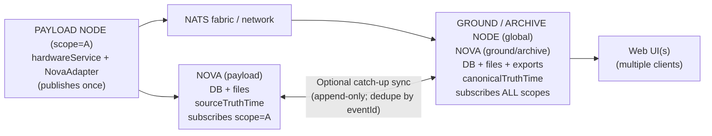
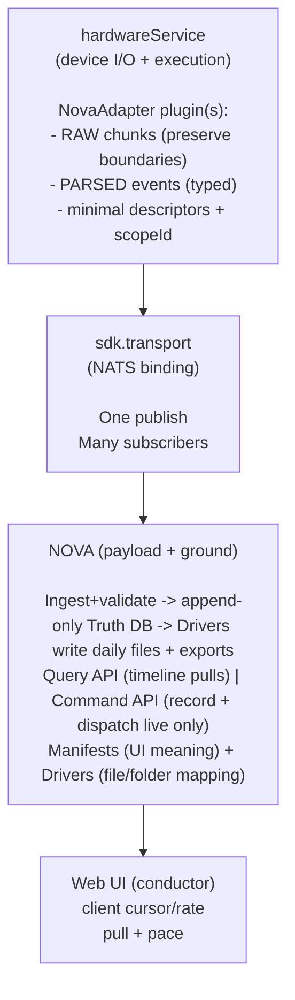
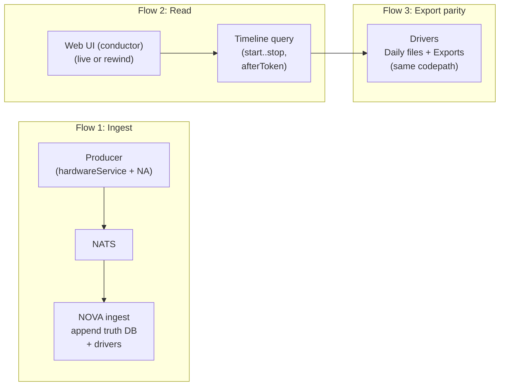

**NOVA 2.0 Architecture Contract**

# Thesis

THESIS: NOVA is seamless, actionable omniscience delivered through a single unified interface.
NOVA is a time-indexed database + single web interface (tightly integrated) that allows rewind capable data/views and real-time command/control. NOVA is a time-indexed truth system that can **serve truth in two delivery modes**: **Query mode** (bounded reads) and **Stream mode** (server-paced playback that follows a client timeline). A well-defined API and driver system allows 3rd party integrations to be easy and complete, with custom data flows, and C2/commands. Single state (saving realTime data and serving client requested data ) tight database coupling ensures data/displays ALWAYS match the client timeline, while driver-based file/folder writes ensure consistent parsed data downloads (same files produced as in real-time mode, but from startTime to stopTime). All implementation is unified: ONE Api, one truth DB per instance (no additional truth stores), ONE transport, ONE data -> file codepath (via drivers)…etc. This allows commands, metadata, and main data/dataflow controls to be inseparable: commands, metadata changes…etc are replayed WITH the data, ensuring truth always matches the client timeline: everything is experientially unified! The actual UI is lightweight: showing summary data, providing a C2 interface and time controls – its underlying database is far more powerful, allowing the UI to serve as the ‘conductor’ – routing dataflows and controlling time from the central core!

# Architecture Invariants

**Timeline truth is complete and ****repayable.** Everything ingested into/through NOVA (data, metadata, commands) SHALL be saved and replayable such that replay reproduces the exact same displays and dataflows for any requested client timeline. Exception: replay SHALL NOT emit C2 effects to external producer systems.

**Determinism is mandatory****.** For identical inputs, NOVA SHALL produce identical outputs: same ingest stream → same database state → same replay results (including ordering). Timestamp collisions SHALL have explicit, stable tie-break rules that never change. Truth-time SHALL be unambiguous per timebase. Payload truth uses sourceTruthTime; ground truth uses canonicalTruthTime. sourceTruthTime is never overwritten; canonicalTruthTime is added for unified operational ordering.

**Replay is read-only with respect to the real world****.**** **Replay SHALL produce no side effects that change hardware state or external systems (hardware actions, C2 commands, third-party service calls). Commands issued during replay SHALL be blocked and not recorded as truth events; they SHALL NOT be executed. **Clarification**: Serving replay data to clients over the network (Web UI, TCP stream-out) is explicitly allowed—this is how replay works in practice. The ban is on command dispatch and real-world state changes, not on data delivery.

Ingest is append-only and auditable. All incoming events SHALL be stored immutably (append-only log semantics). Corrections SHALL be represented by appended correction events, not overwrites. Every command SHALL be recorded as request + progress + result (including failures/timeouts).

**No persistent per-client state. **NOVA SHALL not maintain persistent per-client playback/session state. NOVA may maintain ephemeral per-connection playback state (cursor/rate) required to stream data, which is discarded on disconnect or stream restart.
The client controls playback by issuing Start/Stop/Seek/Rate change requests.

**One way to do everything****. **There SHALL be one API, one inter-service transport (sdk.transport), one database as the single source of truth, and one ingestion/query/render/export pipeline. Web UI SHALL use WebSocket at NOVA edge. Intra-service communication (Server↔Core when co-hosted) MAY use multiprocess IPC/queues. No one-off integrations, regex catch paths, or alternate codepaths are allowed.

**Strict subject + schema contracts****. **Subject identity SHALL be stable across time. Integration contracts SHALL be fixed, documented, versioned, and enforced—no implicit schema inference. **Canonical public subject format**: `nova.{scopeId}.{lane}.{systemId}.{containerId}.{uniqueId}.v1`. NOVA may **derive** missing IDs from subject or config, but must **reject** envelopes where provided IDs conflict with subject/config-derived values (no silent mutation).

**Timebase**** and ordering are first-class contracts****.**** **NOVA SHALL define one canonical timebase for truth playback and one ordering contract that applies across all lanes (data, metadata, commands). Any consumer (UI, exports, PlotJuggler, TCP loopback, etc.) SHALL observe the same ordering.

**Unified experience for awareness and control****. **Observation and control SHALL remain inseparable: the same views, controls, and APIs apply in live and replay. No separate tools/modes/dashboards.

**Expandable Structure****.** NOVA will be run locally and over the network. Scope and database sync must be necessary, stateless, and capable of support seamless local and network operation, with the scope being changed as a runtime config. Code structure must be simple, and portable/modular where possible, using inheritance and abstraction where possible to minimize overall lines of code, reuse code paths, and simplify overall structure. Hardcoding and limiting design patterns should be avoided.

# 1) Scope and Definitions

| Topic | Contract |
| --- | --- |
| What NOVA is | A time-indexed truth system (DB + files) plus a single web UI that queries truth by client timeline and provides live + rewind command/control through the same surfaces. |
| What NOVA is not | Not a per-client persistent session server (stream connections are ephemeral and replayable from truth); not a best-effort replay; not a UI-definition system owned by producers; not a hardware executor in replay. |
| Single unified interface | One interaction model: (a) navigate time, (b) select views, (c) issue commands, (d) observe command effects on the same timeline (live or rewind). |

| Term | Definition (contract meaning) |
| --- | --- |
| Timeline | Client cursor + playback rate that determines which truth window is requested. Timeline state lives on the client. |
| Truth | All recorded events needed to reproduce the same displays and dataflows at a given timeline time (data + commands + metadata + UI updates). |
| Truth-time | Time used for ordering and queries in a given context. Ground defaults to canonicalTruthTime; payload defaults to sourceTruthTime. API may optionally select Timebase = Source \| Canonical; defaults depend on node role. |
| Live | Client chooses a timeline policy that tracks near-now, while still using the same query model as rewind. |
| Replay | Serving truth for any time range with no external side effects. Commands are shown but not executed. |
| Lane | A named class of events with a fixed envelope and invariants (raw bytes, parsed events, UI updates, commands, metadata, etc.). |
| Driver | NOVA plugin that maps truth to daily files and windowed exports using the same codepath. |
| Manifest/View | NOVA-owned UI definitions (cards/shields/commands). Client-specific presentation (names/colors) may override display only. |
| Scope | Routing/visibility domain tag (scopeId). Payload node uses its own scope; ground/archive subscribes to all scopes. |

# 2) Core Principles (non-negotiables)

| Constraint | Operational rule |
| --- | --- |
| One DB (system of record) | One truth DB per NOVA instance. Authority is per scope: payload is authoritative for its ScopeId; ground mirrors all scopes append-only for a unified operational view. No separate truth DBs for UI/tools. |
| Scope authority (distributed truth) | Payload authors its scope. Ground mirrors all scopes append-only. No node overwrites another node’s events |
| Two timebases, one rule | sourceTruthTime is never overwritten; canonicalTruthTime is added at ground ingest for unified view. |
| Transport layers | Inter-service: All producer↔NOVA and NOVA↔NOVA traffic uses sdk.transport (NATS binding). **Transport subjects are a public integration contract**: non-SDK producers MAY publish directly to /transport subjects if they conform to the subject format and message schemas (SDK usage is preferred for convenience, but not required). Truth ingest remains exclusively via /transport. UI: NOVA↔Web UI uses WebSocket at NOVA edge (one websocket per UI instance/tab/window). Intra-service: Server↔Core may use multiprocess IPC/queues when co-hosted. Future external integrations still go through NOVA and will use the same API semantics. |
| One way to replay | Replay is served from truth with the same ordering and UI surfaces; replay emits no external effects. |
| One way to export | Exports use the same driver codepath as real-time file writing (parity by design). |
| Archive hardware data collection | Local NOVA instances use their own ScopeId and are the authoritative writers for events in that scope. Ground/Archive runs the same NOVA service configured with a global subscription (all scopes) and mirrors events from all scopes append-only into its own DB. Mirroring is an append-only mirror with EventId dedupe (ignore duplicates); ground never overwrites payload events. Ground may add canonicalTruthTime for unified cross-scope operational ordering without altering any payload-authored fields (including sourceTruthTime). Ground is authoritative for cross-scope ordering (canonicalTruthTime). Payload remains authoritative for all payload-authored event content in its scope. Ground NOVA is simply a NOVA instance with broader subscription filters + append-only EventId dedupe; no separate sync subsystem is architecturally required. |

# 3) System Model

Conceptual entities and relationships. KEY: everything has a unique ID.

**Public/external identity is always**: `scopeId + lane + systemId + containerId + uniqueId`

| Entity | Unique ID | Role / relationship |
| --- | --- | --- |
| System | systemId | The data system that produced the truth (e.g., hardwareService, adsb, thirdPartyX). Publishes raw/parsed/ui_update/metadata; executes commands in live. |
| Scope | scopeId | Visibility/routing tag. Ground subscribes to all; payload subscribes to its own. |
| Container | containerId | The node/payload/site/vehicle/rig/platform instance the producer belongs to (e.g., node1, payloadA, truck7). |
| Entity | uniqueId | The entity identifier within that system+container (deviceId/taskId/etc). Required for anything renderable. |
| Stream (parsed) | streamId | Semantic typed stream identity (parsed lane). Optional technical label, not primary identity. |
| Connection (raw) | connectionId | Raw-byte source identity (TCP/serial/etc.). Optional debug label, not required for 3rd parties. |
| Event | eventId | Unique truth record in any lane (dedupe + audit + replay). |
| Command | commandId | Correlates request/progress/result. |
| Driver | driverId | Versioned truth→files/exports implementation. |
| Manifest/View | viewId + viewVersion | Versioned UI definition controlling allowed UI update keys and layout. |

| Field | Meaning | Defaults |
| --- | --- | --- |
| sourceTruthTime | Receive-time at payload/local NOVA (locally true). | **Payload-local node default timebase**: SourceTruthTime (UI and queries default to source timebase). |
| canonicalTruthTime | Receive-time at ground/archive NOVA (unified operational). Assigned once at ingest by the receiving NOVA instance as that node's wall-clock receive timestamp, and is never recomputed or modified during replication or replay. | **Ground/aggregate node default timebase**: CanonicalTruthTime (UI and queries default to canonical timebase). UI defaults reflect node role (payload vs ground). |

# 4) Planes and Responsibilities

| Plane | Responsibilities | Replay rule |
| --- | --- | --- |
| Data plane | Ingest and store raw chunks + parsed events + UI updates as truth. Serve by timeline queries. | Replayed exactly; no side effects. |
| Command plane | Record command request/progress/result. Live dispatch executes via producer. | No execution – block in UI and server. |
| Metadata plane | Producers publish minimal descriptors (identity/capabilities/stream descriptors). NOVA owns UI meaning + file mapping. | Metadata is replayed with data to match timeline. |

Operational meaning of “inseparable”: same UI surfaces + same timeline for data/commands/metadata in live and replay; only external effects are disabled in replay.

# Figures (text-rendered diagrams)

These diagrams are included as **text** (Mermaid) so the document stays human-readable as a single `.md` file.

## Figure 1 — Payload vs Ground / Archive scope topology

## Figure 2 — Producer → Transport → NOVA → Web UI

## Figure 3 — “Golden flows”: ingest, read, export parity

# 5) External Contracts

## 5.1 Public API Contract (Single Surface)

Principle: one public contract for live and rewind. “Live” is simply a client timeline policy that tracks near-now using the same query model as rewind.

All payloads are versioned. Contract changes are explicit; schema creep is not allowed.

| Category | Read/Write | Contract summary |
| --- | --- | --- |
| Timeline Read | Read | "Query by time window (StartTime..StopTime) + filters. NOVA maintains no persistent per-client playback/session state. NOVA may maintain ephemeral per-connection playback state (cursor/rate) required to stream data, and it is discarded on disconnect or stream restart. **Server-authoritative playback cursor**: Client timeline position is derived from the last-emitted event's time in the chosen timebase (echoed in chunk.timestamp). Client must not free-run a clock; client may interpolate cosmetically between chunks but must correct to server truth on each chunk. Deterministic ordering. Same semantics in live and rewind. Includes: Query Read: bounded window reads [T0..T1] for snapshots, exports, and random access. Stream Read: server-paced playback from StartTime toward StopTime (or open-ended) at Rate. **LIVE mode** (rate > 0, stopTime=null): Notification-driven push-based streaming; server wakes on ingest notification and emits at user-requested rate (no polling loops). **REWIND mode** (rate ≠ 0, stopTime=null or set): Infinite backward (rate < 0) or bounded forward/backward playback (stopTime set), paced by rate. Any change (mode/timebase/rate/scope) must cancel + restart with new playbackRequestId for fencing. NOVA must never interleave outputs from two playback requests for the same client connection. Stream Read is implemented as repeated deterministic bounded reads under the hood; the only state is the active request parameters + last-emitted position, held only while the connection is open. A new Stream Read request for the same client connection automatically terminates the prior stream. |
| Stream Discovery | Read | Discover available streams/connections/assets and their descriptors. Returned descriptors must be time-versioned (what was true at time T). |
| Commands | Write + Read | Write command requests; read command events (request/progress/result) on the same timeline as data and UI updates. |
| UI Updates | Write + Read | Write UiUpdate events (partial upsert). Read UiUpdate/UiCheckpoint for state-at-time(T). Keys are manifest-defined. |
| Exports | Read | Request export for (StartTime..StopTime). Exports must use the same driver codepath as real-time file writing (parity by design). Optional Overrides dictionary for labeling |
| Admin/Identity | Read | NOVA enforces AuthN/AuthZ at the UI/API boundary (admin-managed user allowlist). Admin can: create/disable users, reset credentials, view basic audit events. This does not add per-client state: use stateless tokens for the UI ↔ NOVA edge. |

Open-ended reads: StopTime may be null to mean ‘follow/tail’. StopTime may be omitted to mean “continue streaming until the client changes or stops playback.

Live is defined by client timeline policy (near-now) using the same read API.”

## 5.2 Lane Model (Big Buckets) and Message Types

Lanes are “big buckets” by semantics. Variants are expressed as MessageType within a lane. This prevents lane proliferation and schema creep.

| Lane | MessageType (examples) | Primary identity | Required fields (minimum) | Notes / invariants |
| --- | --- | --- | --- | --- |
| Raw | RawFrame | SystemId, ContainerId, UniqueId | EventId, ScopeId, SourceTruthTime, SystemId, ContainerId, UniqueId, Bytes | Raw is a stream of byte frames. Must preserve read boundaries exactly (no re-chunking). ConnectionId and Sequence are optional (debug/diagnostics). Used for .bin and TCP loopback. |
| Parsed | ParsedMessage | SystemId, ContainerId, UniqueId | EventId, ScopeId, SourceTruthTime, SystemId, ContainerId, UniqueId, MessageType, SchemaVersion, Payload | Parsed is a stream of typed messages. Typed truth for tools and exports. Payload conventions (nulls, tables, ordering) are deterministic. |
| UI | UiUpdate; UiCheckpoint | SystemId, ContainerId, UniqueId, ViewId | EventId, ScopeId, SourceTruthTime, SystemId, ContainerId, UniqueId, ViewId, ManifestId, ManifestVersion, SchemaVersion, Data | UI meaning is NOVA-owned and manifest-defined. UiUpdate is partial upsert. UiCheckpoint is full-state for fast seek/bootstrap. UiUpdate/UiCheckpoint reference ManifestId+ManifestVersion for correct rendering. |
| Command | CommandRequest; CommandProgress; CommandResult; CommandAnnotation | CommandId | EventId, ScopeId, SourceTruthTime, CommandId, MessageType, Data | CommandRequest is always recorded before dispatch. CommandProgress and CommandResult are optional producer emissions. If no CommandResult exists yet, the command is pending/sent (computed UI state). NOVA never dispatches commands during replay. CommandAnnotation is for operator notes (live ingest), not replay attempts. |
| Metadata | ProducerDescriptor; DriverBinding; ManifestPublished | SystemId, ContainerId, UniqueId or ManifestId | EventId, ScopeId, EffectiveTime, SystemId, ContainerId, UniqueId/ManifestId, MessageType, Data | Time-versioned descriptors. ProducerDescriptor and DriverBinding are entity-scoped. ManifestPublished is manifest-scoped and ensures replay can render with the correct manifest version. Minimal producer metadata only; NOVA owns UI meaning and file mapping via drivers. |

**Time fields:** All events stored by NOVA include **sourceTruthTime** (payload-authored context). Ground/Archive NOVA additionally records **canonicalTruthTime** for unified operational ordering across scopes. canonicalTruthTime is **added** at ingest/mirror and does not overwrite sourceTruthTime.

### UiCheckpoint policy (NOVA-owned)

UiCheckpoint events are created by NOVA (not producers) to guarantee efficient state-at-time(T) queries without per-client state.

Recommended emission triggers (configurable, deterministic):

• Periodic: every 60 minutes on the hour per (ScopeId, SystemId, ContainerId, UniqueId, ViewId, ManifestId+ManifestVersion). Interval is configurable, but the schedule must be deterministic.

• On first discovery of a new entity (uniqueId) or ViewId instance.

• On new DriverBinding for an entity/stream that affects UI interpretation.

### State resolution timebase rule

State-bearing metadata events (UiCheckpoint, ManifestPublished, DriverBinding, ProducerDescriptor) carry **effectiveTime** in the event's timebase context.

When resolving "state at time T":
- **Default**: Use canonical timebase for ordering/selection (ground default); payload may default to source timebase
- **Request option**: Client MAY select Source or Canonical timebase for query/stream
- **Metadata eligibility**: 
  - For canonical timebase: metadata event MUST have canonicalTruthTime; evaluate effectiveTime ≤ T using canonical time
  - For source timebase: metadata event uses sourceTruthTime; evaluate effectiveTime ≤ T using source time
  - Events missing the required timebase are ineligible for that timebase query
- **No mixing**: A single query/stream/export SHALL NOT mix timebases; all events in one output use the same timebase

This ensures state resolution is deterministic and consistent regardless of timebase selection.

### Manifest timing and replay truth

Manifest versions are part of truth. Replay must use the same ManifestId+ManifestVersion referenced by UiUpdate/UiCheckpoint at that time.

Therefore, manifest discovery/updates must be captured in time as ManifestPublished events (or an equivalent time-addressable manifest registry that is synced and queryable by timeline).

## 5.3 Ordering, Tie-breaks, and Dedupe (Determinism)

Ordering is a first-class contract. When timestamps collide, tie-break rules are stable and versioned.

| Layer | Rule |
| --- | --- |
| Primary time | Use context timebase as primary sort: CanonicalTruthTime on ground; SourceTruthTime on payload. Timebase is chosen per request and must not mix within one read/export/TCP stream. |
| Lane priority (when primary time ties) | Explicit, stable order: Metadata → Command → UI → Parsed → Raw. (Any change requires a contract version bump.) |
| Within-lane ordering | All lanes use (timebase) then EventId. EventId is the final tie-break for all lanes (deterministic comparison). If sequence is present on Raw events, it can be used as an extra stable tie-break within the same entity, but is not required. |
| Dedupe / idempotency | EventId is globally unique, immutable, and deterministic (same event content → same EventId). Implementation may use content-derived identifiers (e.g., a canonicalized hash of the event envelope). When used as an ordering tie-breaker, EventId is compared deterministically (e.g., lexicographic byte order). Duplicates are ignored during mirroring/sync. CommandRequest also supports idempotency via RequestId. |

This ordering contract applies identically to Query Read, Stream Read, Exports, and TCP loopback.

## 5.4 Driver Selection and DriverBinding (Deterministic Mapping)

Drivers are NOVA plugins that define the truth→files/export mapping. Producers describe streams; NOVA selects the driver deterministically and records the binding as truth.

| Step | Contract rule |
| --- | --- |
| Driver registry | NOVA loads drivers as plugins. Each driver declares DriverId (+ DriverVersion) and supported (Lane, StreamType, SchemaVersion) and optional capability predicates. |
| Selection inputs | StreamType + SchemaVersion (required) plus optional capabilities from ProducerDescriptor and NOVA config. |
| Deterministic selection | Given identical inputs and config, NOVA selects the same DriverId/DriverVersion. |
| Binding event | NOVA writes a DriverBinding metadata event: TargetId (StreamId or ConnectionId) → DriverId/DriverVersion with EffectiveTime. |
| Usage | Real-time file writing and rewind exports both use the DriverBinding-at-time(T) to ensure parity. |

DB ingest is primary truth and must not be blocked by file writes. File writing is derived; failures are recorded for audit and retry

# 6) Primary Data Flows (End-to-End)

Golden paths: everyone must agree on these workflows. They are the reference behavior for live, replay, and export.

| Flow | Actors | Steps | Guarantee |
| --- | --- | --- | --- |
| (1) Real-time ingest → store → display | Producer; NOVA (payload + ground); Web UI | Producer publishes Raw/Parsed/UI/Metadata via transport. NOVA appends truth to the DB and runs drivers for continuous daily file writes.
Web UI opens Stream Read (open-ended / LiveFollow) at CursorTime≈Now; NOVA pushes ordered truth continuously.
Query Read is used only for bootstrap (initial state), seek, and export. | Display matches truth at timeline time. Drivers write daily files continuously. Ground holds unified operational view. |
| (2) Command → record → execute (live) → timeline | Web UI; NOVA; Producer | Web UI writes CommandRequest.
NOVA records request immediately.
Live only: NOVA dispatches to Producer for execution.
Producer publishes CommandProgress and CommandResult.
NOVA records; UI renders on the same timeline. | Every command is auditable (request→progress→result). Replay never executes commands. |
| (3) Rewind → same render + same exports | Web UI; NOVA; Drivers | Web UI requests Stream Read with StartTime, optional StopTime, Rate, and Timebase; NOVA pushes ordered truth paced to the requested timeline.
Seek/rate change = Web UI issues a new Stream Read request; NOVA restarts playback from the new timeline.
Export(StartTime..StopTime) uses Query Read + the same driver codepath to generate identical artifacts. | Replay produces the same displays/dataflows (minus external effects). Exports match real-time artifacts for that window. |

# 7) Timeline Truth and Replay Semantics

These rules remove ambiguity about what “ALWAYS match client timeline” means, and prevent “best effort” replay.

| Topic | Contract statement |
| --- | --- |
| Timeline correctness | For any timeline position T, displayed state is a deterministic function of recorded truth at/through T (data + UI + commands + relevant metadata). |
| UI state-at-time(T) | NOVA serves UI state at time T using the latest UiCheckpoint ≤ T plus subsequent UiUpdate upserts ≤ T, in deterministic order. |
| Manifest truth | UiUpdate/UiCheckpoint reference ManifestId+ManifestVersion. Replay renders using that exact manifest version; manifest availability is guaranteed by recorded ManifestPublished (or equivalent time-addressable registry). |
| Replay side effects | Replay produces no external effects. Commands are blocked in replay: (1) the client blocks the UI action and warns, and (2) NOVA refuses dispatch when the request indicates replay context (TimelineMode=Replay, or equivalent). Replay command attempts are not written to the truth DB and are never executed. |
| Raw TCP fidelity | Raw lane preserves byte frame boundaries; TCP loopback replays the exact frames in order (no re-chunking). THIS IS A FIRST CLASS STREAM READ:  TCP loopback is Stream Read of the Raw lane delivered over TCP. It emits exact recorded raw frames in the recorded order.Pacing follows the same client timeline parameters (StartTime, optional StopTime, Rate, Timebase). The TCP client only ingests bytes; control happens via the normal UI control channel. |
| Parity of exports | Exports are produced by drivers using the same mapping codepath as real-time daily file writing. |
| Timeline stream Contract | A client may request Stream Playback with: StartTime, StopTime (optional) — if absent, playback continues until changed/stopped ("open-ended"), Rate (positive/negative), Timebase (Source or Canonical).  NOVA emits events in deterministic order according to the ordering contract. NOVA paces emission so that the stream output corresponds to the client's requested timeline rate and direction. If the client changes time/rate, the client issues a new playback request, and NOVA restarts the stream accordingly. **Stream fencing**: Each playback request includes a unique fence token (e.g., playbackRequestId); every emitted chunk echoes this token. The receiver drops chunks not matching the active request ID, guaranteeing no interleaving after seek/rate changes. |
| Always match client timeline | At any moment, the UI is only allowed to display data that NOVA has emitted for the client’s current playback request.
When playback changes (seek/rate), the previous stream is invalidated and must not be mixed with the new one. |

# 8) Single Implementation Pattern

| ONE | Meaning | Guardrail |
| --- | --- | --- |
| Transport | Inter-service: All producer↔NOVA and NOVA↔NOVA communication uses sdk.transport (NATS). UI: Web UI connects via WebSocket at NOVA edge (Server process). Intra-service: Server↔Core may use multiprocess IPC/queues when co-hosted. No producer or third party talks to the browser directly; they always go through NOVA for rewind. | No service-to-service HTTP paths. WebSocket is permitted only as NOVA's UI edge. Multiprocess IPC/queues are permitted only within a single NOVA instance (Server↔Core). Future HTTP bindings (if added) must expose the same API semantics, not a second API. |
| API model | Truth is recorded once (append-only) and served in two delivery modes:
(1) Query mode: bounded reads for random access + exports.
(2) Stream mode: NOVA plays a client-defined timeline (StartTime, optional StopTime, Rate) and pushes the ordered truth continuously until changed. | No “client-side timeline reconstruction” as the primary behavior.
Stream mode is the fundamental way to guarantee “UI equals timeline truth” for live + replay.
Query mode exists for seeking, bootstrapping, and exports—never as a second competing playback model. |
| DB | One truth DB per NOVA instance; ground is unified operational view. | No extra truth stores for UI/tools. |
| Data->file | Drivers define file structure and exports. | No one-off exporters. |
| Validation | NOVA validates subjects/schemas/IDs; rejects or quarantines invalid inputs. | No implicit inference or best-effort parsing. Subjects are constructed centrally by sdk.transport (no ad-hoc strings). NOVA validates required subject dimensions (ScopeId + Lane + identity) and schema version |
| Per-user overrides contract | Each user creates their own presentation (custom models, colors, names..etc). Admin can broadcast suggested defaults. | **Overrides are presentation-truth events (Metadata lane)**; may be recorded and broadcast by NOVA; they affect **rendering/export labeling only** (never telemetry truth). Admin suggested defaults apply if the user has not customized. Export may include a computed overrides dictionary for convenience, derived from replayed override events. NOVA applies overrides only to export labeling (file/folder names, CSV header labels if desired) while keeping stable ID-based internal paths for determinism. |
| Playback delivery | UI playback and TCP playback use the same Stream mode semantics.
UI receives a pushed stream over WebSocket; TCP consumers receive a pushed stream over TCP. | No sidecars required for TCP smoothing.
TCP replay is server-paced; clients only ingest bytes. |

## 8.1 TCP Stream-Out (Output Mechanism)

TCP streams are **output forks** that deliver truth data over TCP to external integrators. They are NOT truth sources—they read from truth and emit bytes/JSON.

| Aspect | Contract |
| --- | --- |
| What it is | A low-latency pass-through output that follows either LIVE data or a client's timeline cursor. |
| What it is NOT | A truth data source. TCP stream definitions and sessions are operational config, not observed reality. |
| Default behavior | LIVE-follow: stream tails real-time data with no WebSocket required. Integrators connect → receive live data → done. |
| Timeline binding | Optional: if a user enables "Tie to my timeline," the stream follows their WebSocket cursor (replay/seek/rate). |
| Binding model | Last-binder-wins. If the bound WebSocket disconnects, stream falls back to LIVE-follow. New instances must explicitly rebind. |
| Output formats | `payloadOnly`: raw bytes or JSON payload only (requires single-identity selection). `hierarchyPerMessage`: `{"s":"...","c":"...","u":"...","t":"...","p":{...}}` (multi-identity safe). |
| Backpressure | Default: catch-up (drop queued data on buffer full, continue from cursor). No markers in stream. |
| Persistence | Stream **definitions** (name/port/selection/format/createdBy) persist in config DB (`streams.db`), not truth DB. Sessions and connections are ephemeral. |
| No ghost streams | TCP output is connection-driven. No TCP clients connected → no background emission. |
| No tcp-of-tcp | Streams cannot select TCP stream outputs as sources (prevents recursion). |

Hardware layout

Each scope runs its own standalone local stack:

NOVA (local) + producer(s) (for now: hardwareService) run on the same machine or same local network boundary.

Each local NOVA instance subscribes only to its local producers over /transport:

Locality is determined by scope.

A local NOVA should not need any other site’s hardwareService to function.

A Ground/Archive node is just another NOVA instance configured with broader subscriptions:

It subscribes to all scopes / all local producers over /transport.

That means everything is still “over transport,” but local NOVAs only listen to local truth, while Ground listens to everything.

Replication/mirroring behavior is still simple:

Ground ingests everything it sees and stores it append-only with EventId dedupe.

Ground does not require a separate “sync subsystem.”

Code structure

NOVA runs as two cooperating processes with a strict split of responsibility:

Core process: owns all DB writes/reads, ingest normalization, deterministic ordering, playback/query/export.

Server process: owns WebSocket/TCP edges, auth, request routing, and forwards to Core.

The two processes communicate via a small set of multiprocess-safe queues (or equivalent IPC):

Server → Core: query, startPlayback, cancelPlayback, submitCommand

Core → Server: queryResults, streamEvents, errors/acks

NOVA talks to producers through a clear producer API over /transport:

Producers publish truth events; NOVA ingests them.

Producers receive command dispatches; they publish progress/results.

For now, the first producer is hardwareService:

You will modify hardwareService’s API/envelopes as needed to match NOVA’s expectations (e.g., adding scope and aligning field conventions).

Implementation approach in the codebase:

Functional separation into clean modules (DB/ingest/order/replay/export/edge/producer-adapters).

Minimal duplicated code paths: use inheritance/abstraction/plugin-style behaviors so adding new producers or new event lanes doesn’t create parallel implementations.

“Plugin behaviors” means: same core pipeline, different adapters/drivers.

Golden paths (short + clear)
1) Live ingest (truth recording)

Producer (hardwareService) publishes truth events on /transport (scoped).

Local NOVA Core subscribes to its local scope, then:

validates/normalizes

dedupes by EventId

assigns canonicalTruthTime once

appends to the single truth DB (append-only)

Ground/Archive NOVA subscribes to all scopes and mirrors the same events (append-only + dedupe).

2) Timeline query (bounded read)

Web UI → Server → Core

Core reads the requested time window from the DB and returns results in the one ordering contract.

Server relays results; it does not reorder or “fix” data.

3) Playback stream (replay/live from DB)

Web UI → Server → Core starts playback for a time window + rate.

Core streams events from DB at server pace using the same ordering contract.

Any seek/rate change: cancel + restart (no interleaving outputs).

4) Live command (executed + fully recorded)

Web UI → Server → Core submits a command (scoped).

Core records CommandRequested in DB, then dispatches via /transport to the producer.

Producer executes and publishes progress/results on /transport.

Core ingests those and appends them to DB; UI sees updates via stream/query.

5) Replay safety (no side effects)

In replay context, commands are blocked:

Server rejects for UX.

Core refuses dispatch as the authority.

Replay never triggers hardware actions and does not write replay-attempt commands as truth.

6) Export parity (same truth, same order)

Web UI → Server → Core requests export for a time window.

Core reads DB and generates output using the same ordering contract as query/stream.

SUMMARY:
NOVA is a single, authoritative record-and-replay system: it continuously ingests all operational truth (raw data streams, parsed streams, UI updates, commands, and minimal descriptors), stores it in a time-indexed database, and then serves that same truth back to clients either by query (time windows for seeking/exports) or by server-paced streaming playback (start time, optional stop time, rate, timebase). It provides one unified web interface for real-time awareness and command/control, and guarantees that what users see—and what gets exported or looped back over TCP—always matches the chosen client timeline, with replay reproducing the same experience without causing real-world side effects.